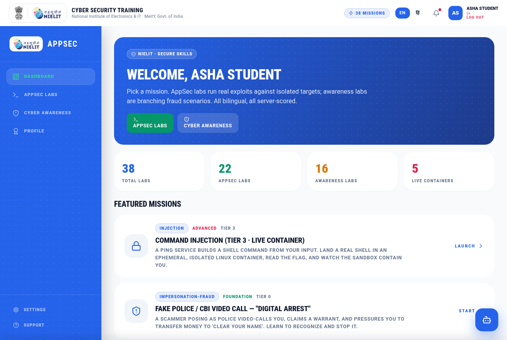
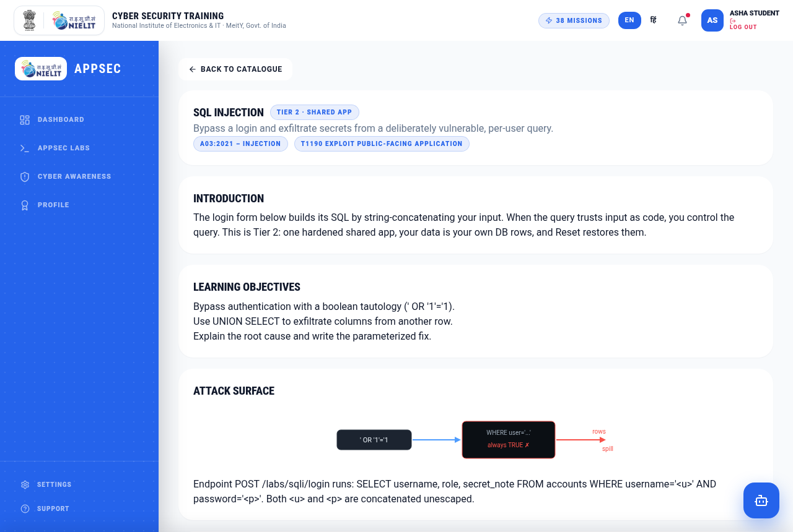
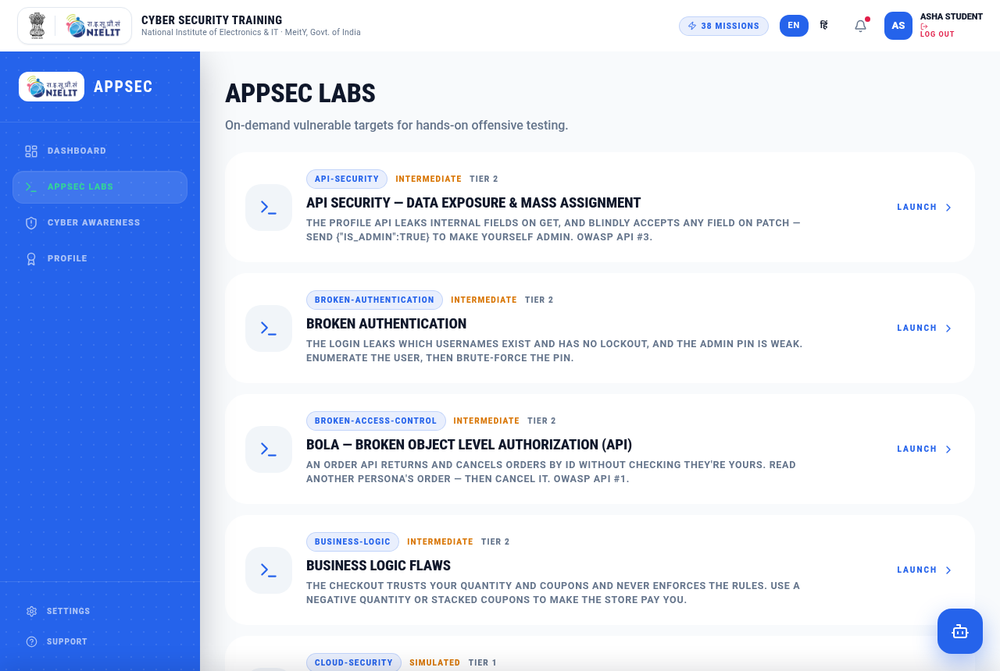
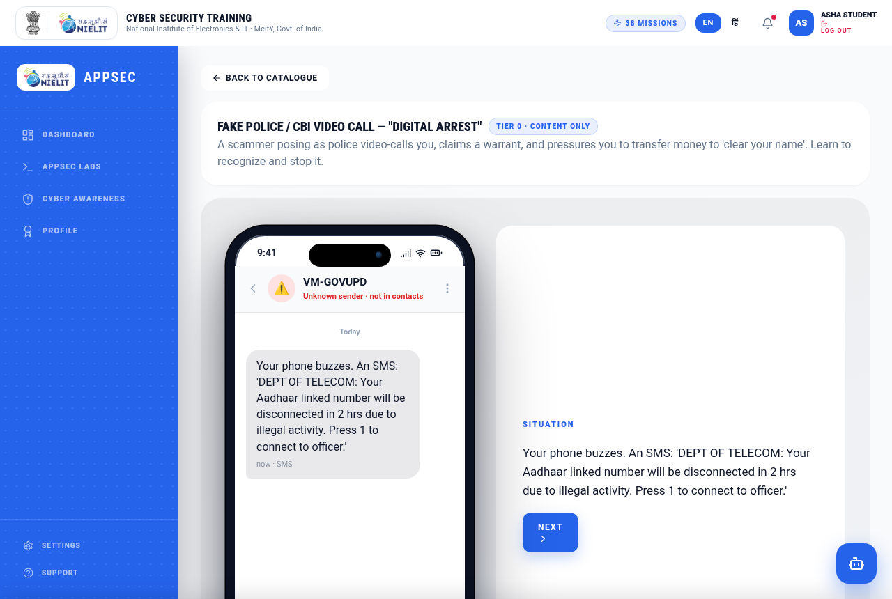
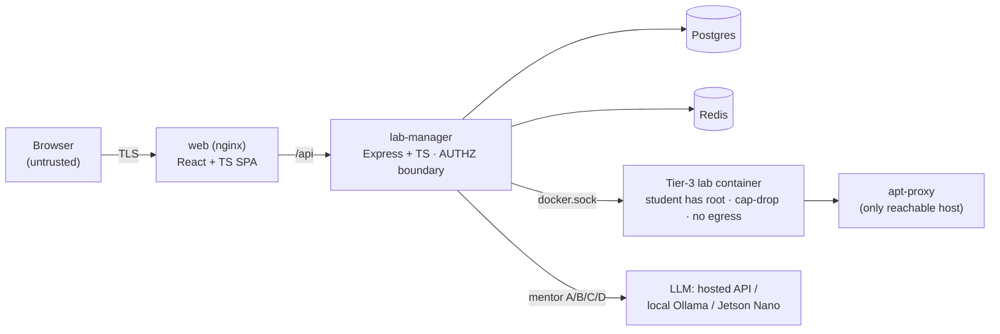

<div align="center">

# 🛡️ NIELIT AppSec + Cyber-Awareness Platform

**A bilingual (English + हिंदी) security-training platform — exploit real vulnerable apps in
sandboxed labs, and learn to spot real-world scams in interactive simulations. Runs on a
single ~5 GB VM.**

[](https://github.com/udayydogra/nielit-appsec-cyber-awareness/actions/workflows/ci.yml)
[](https://github.com/udayydogra/nielit-appsec-cyber-awareness/actions/workflows/security.yml)
[](https://github.com/udayydogra/nielit-appsec-cyber-awareness/actions/workflows/codeql.yml)


</div>

---

## 📸 See it running

<table>
  <tr>
    <td width="50%"></td>
    <td width="50%"></td>
  </tr>
  <tr>
    <td align="center"><b>Dashboard</b> — 38 labs, live-container count, bilingual (EN / हिं), server-scored</td>
    <td align="center"><b>SQL Injection lab</b> — Tier 2, OWASP A03 + MITRE T1190, live injectable endpoint</td>
  </tr>
  <tr>
    <td width="50%"></td>
    <td width="50%"></td>
  </tr>
  <tr>
    <td align="center"><b>AppSec catalogue</b> — 22 OWASP-mapped labs across execution tiers</td>
    <td align="center"><b>Scam simulation</b> — a realistic phone mockup drives the "digital arrest" fraud scenario</td>
  </tr>
</table>

> **Try it in 30 seconds:** `vagrant up` (or `sudo bash scripts/provision-vm.sh` on any
> Linux) → open <http://localhost:8080> → log in with `student@nielit.test` / `password123`.
> Full guide: [`VM-SETUP.md`](VM-SETUP.md).

---

## ✨ What it does

Two modules share one content engine, one telemetry spine, one AI-mentor pipeline:

- **🎯 AppSec module** — hands-on vulnerability labs (SQLi, XSS, IDOR/BOLA, SSRF, XXE,
  command-injection, deserialization, path-traversal, …). You *perform* the exploit against a
  real vulnerable target and are walked through the fix. Routed by a **tiered execution model**
  so a real per-user container is the exception, not the default.
- **🧠 Cyber-Awareness module** — branching, scenario-based fraud training (UPI scams, fake
  "digital arrest" CBI calls, phishing, OTP/SIM-swap, deepfake voice) rendered in a realistic
  phone mockup, with AI-generated talking-head scammers and read-aloud audio.

Everything is **bilingual by design** and **server-scored** (completion can't be forged).

## 📊 By the numbers *(extracted from the code)*

| | | | |
|---|---|---|---|
| **38** labs · 22 AppSec / 16 awareness | **~7,400** LOC TypeScript | **70** API routes | **65** `requirePermission` enforcement points |
| **4** roles · **20** permissions (RBAC as data) | **4** execution tiers | **10** Docker services | **14** talking-head videos · **92** audio clips |

## 🏗️ Architecture



The two dominant trust boundaries: **browser → API** (deny-by-default AUTHZ) and **Tier-3
container → host/tenants** (real root inside a boring sandbox). Full diagrams + design
decisions in [`docs/ARCHITECTURE.md`](docs/ARCHITECTURE.md).

### The tiered execution model

| Tier | What runs | Cost |
|---|---|---|
| 0 / 1 | content-only (awareness scenarios, methodology labs) | ~0 |
| 2 | one shared, hardened vulnerable app (per-user = a DB row + reset) | ~150–300 MB total |
| 3 | ephemeral per-user Linux container, `apt`-enabled, capped + reaped | ~80–200 MB / active user |

## 🔐 Security (evidence, not adjectives)

This is a security product, so it's built and reviewed like one — and the artifacts are here
to read:

- 🐛 **[Vulnerability write-up](docs/writeups/sqli-sandbox-escape.md)** — a real sandbox escape
  I found by red-teaming my own platform (the SQLi lab leaked live bcrypt hashes + quiz answer
  keys) and the least-privilege fix.
- 🧭 **[Threat model](THREAT-MODEL.md)** — full **STRIDE** analysis with trust boundaries.
- 🛡️ **CI security gate** — every push runs **Semgrep** (incl. [custom rules](.semgrep/rules/nielit.yml)),
  **Trivy** (deps / IaC / secrets), **Gitleaks**, and **CodeQL**; findings land as SARIF in the
  Security tab (badges above).
- 📜 **[Security policy](SECURITY.md)** — responsible disclosure + in/out-of-scope.

Access control is **deny-by-default**: JWT sessions in **HttpOnly / SameSite** cookies,
**permission** checks (not role checks) at **65 call sites**, **anti-BOLA scope resolvers**
(`selfScope` takes the target id from the session — structurally removing IDOR — plus
`cohortScope` and `containerOwnerScope`), and **audit logging** on every denial and cross-user
access. The injectable SQLi lab runs on a restricted `nielit_lab` DB role against a
session-local temp table, so a real injection can't reach real data.

## 🚀 Quick start

**In a VirtualBox/KVM VM (out of the box)**

```bash
vagrant up --provider=libvirt        # or --provider=virtualbox
# → http://localhost:8080   (API: http://localhost:4000/health)
```

**Already on Linux? Skip the VM — run Docker directly:**

```bash
sudo bash scripts/provision-vm.sh    # installs Docker, generates secrets, builds + runs
```

**With Docker directly:**

```bash
cp .env.example .env                 # pick mentor Profile A (api) / B / C / D (Jetson Nano)
# generate real secrets:  openssl rand -hex 32  → JWT_SECRET, CERT_SIGNING_SECRET
docker compose up --build            # add --profile local-llm for the in-VM LLM
```

Seed logins (dev): `student@nielit.test` · `instructor@nielit.test` · `admin@nielit.test`,
password `password123`.

## 🧩 The AI mentor — four deployment profiles, one env var

| Profile | `MENTOR_PROVIDER` | Model runs on |
|---|---|---|
| A | `api` | Hosted API |
| B | `ollama` | Another box on your LAN |
| C | `ollama` | Inside the VM (`--profile local-llm`) |
| **D** | `jetson` | A **Jetson Nano** on the LAN (edge offload) |

The widget always talks to your backend, never the model host. Details:
[`VM-SETUP.md`](VM-SETUP.md#profile-d--running-the-mentor-on-a-jetson-nano).

## 🛠️ Tech stack

- **Frontend** — React · TypeScript · Vite · Tailwind · xterm.js (real in-browser terminal)
- **Backend** — Node · Express · TypeScript · Postgres · Redis · node-pty · nodemailer · exceljs · JWT/bcrypt
- **Infra** — Docker Compose (10 services) · apt-cacher-ng · Ollama · an isolated internal network
- **AI media** — Indic Parler-TTS · Stable Diffusion 1.5 · Wav2Lip + GFPGAN ([pipeline repo](https://github.com/udayydogra/nielit-awareness-media))
- **Security CI** — Semgrep · Trivy · Gitleaks · CodeQL → SARIF

## 📁 Repository layout

```
web/                React + Vite SPA — scenario engine, AppSec renderer, mentor widget
lab-manager/        Express + TS — tiered routing, RBAC, telemetry, scoring, certs, mentor
labs/manifests/     38 validated content manifests (adding a lab = a JSON file, not code)
lab-images/         Tier-3 vulnerable target images
db/                 Postgres schema + seed (users, roles, cohorts, quiz_keys …)
.semgrep/ .github/  custom SAST rules + CI/security workflows
docs/               architecture, threat model, write-ups, screenshots
```

## 📚 Docs

[Architecture & design decisions](docs/ARCHITECTURE.md) ·
[Threat model (STRIDE)](THREAT-MODEL.md) ·
[Vulnerability write-up](docs/writeups/sqli-sandbox-escape.md) ·
[VM + Jetson setup](VM-SETUP.md) ·
[Security policy](SECURITY.md)

---

<div align="center">
<sub>Built as a NIELIT (MeitY, Govt. of India) security-training platform. Character faces + voices in the awareness labs are AI-generated and depict <i>fictional</i> scammers for training only.</sub>
</div>
