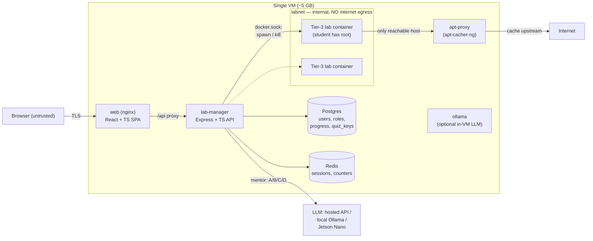
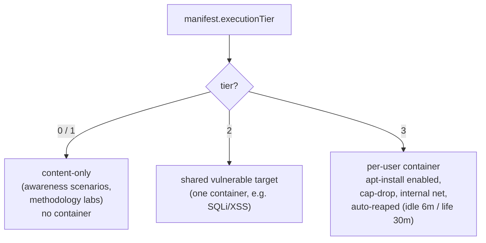
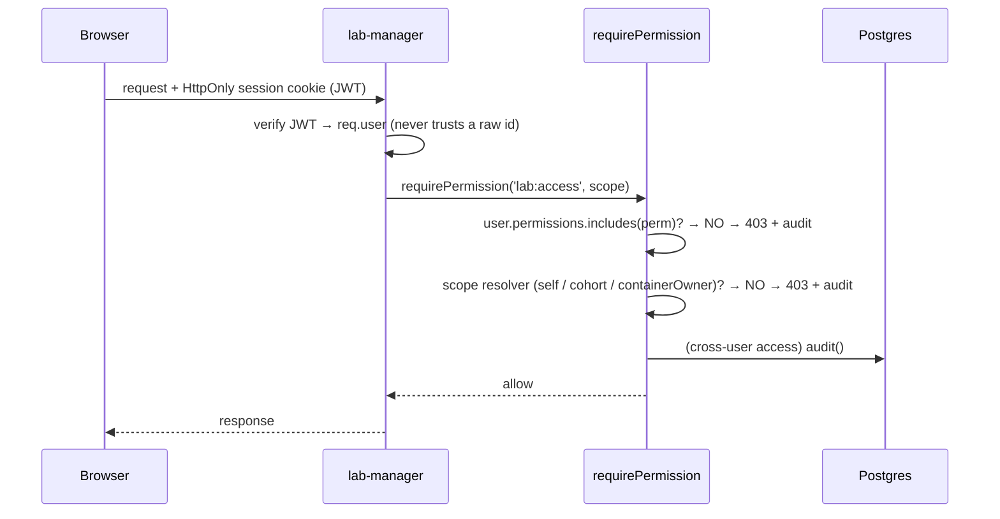

# Architecture & Design Decisions

A bilingual security-training platform: hands-on AppSec labs (exploit real vulnerable apps)
and interactive scam-recognition simulations — one engine, content as data, sized to run on a
single ~5 GB VM.

## By the numbers (all extracted from the code)

| | |
|---|---|
| TypeScript | **~7,400 LOC** (3,476 backend · 3,951 frontend) |
| API routes / authz enforcement | **70 routes · 65 `requirePermission` call sites** |
| RBAC | **4 roles · 20 permissions** (grants stored as DB data) |
| Labs (content as data) | **38 manifests** — 22 AppSec + 16 awareness |
| Execution tiers | **4** (content · shared target · per-user container) |
| Services (Docker Compose) | **10** |
| Tier-3 target images | **5** (cmdi, ssrf, xxe, deserialization, path-traversal) |
| Media | **14 talking-head videos · 92 read-aloud clips** |

## System architecture

Two trust boundaries dominate the design: **browser → API** (every request hostile until
authorised) and **Tier-3 container → host/other tenants** (student has root inside).

## Tiered execution — content declares its own runtime

The backend routes on this one field — a phishing lesson costs nothing to serve; a
command-injection lab gets a real, disposable box. Same codebase, both paths.

## Request → authorization flow (deny-by-default)

## Key design decisions (the "why")

- **One engine, N content files.** Adding a lab = dropping in a validated JSON manifest, never
  writing code. This is why the catalogue scaled to 38 without the codebase growing.
- **Content as data → validation is testable.** A loader validates every manifest at startup
  (start node exists, every `goto`/`next` resolves, reachability, media files present).
- **Deny-by-default RBAC checking *permissions*, not roles**, plus **anti-BOLA scope
  resolvers** (`selfScope` structurally removes IDOR by taking the target id from the session,
  never the URL). Enforced at 65 call sites; denials + cross-user access are audited.
- **Least privilege for the injectable lab** — the SQLi query runs on a restricted `nielit_lab`
  role against a session-local temp table, so a real injection can't reach real data. See the
  [write-up](writeups/sqli-sandbox-escape.md).
- **Realism inside a boring sandbox** — a real root shell and real `apt` (via a contained
  proxy), inside a cap-dropped, internal-network, auto-reaped container.
- **i18n in the data, not the logic** — a single `LocalizedString {en, hi}` threaded through
  one render path; translations live together and can't drift.
- **Provider-abstracted AI mentor** — one env var picks hosted API / local Ollama / Jetson
  Nano; the widget always talks to the backend, never the model host.
- **Sized for a 5 GB VM** — memory limits per service, an atomic Redis counter that caps + queues
  Tier-3 concurrency, and a shared mentor semaphore.

See also: [`THREAT-MODEL.md`](../THREAT-MODEL.md) (STRIDE) ·
[`VM-SETUP.md`](../VM-SETUP.md) (run it) ·
[write-ups](writeups/).
